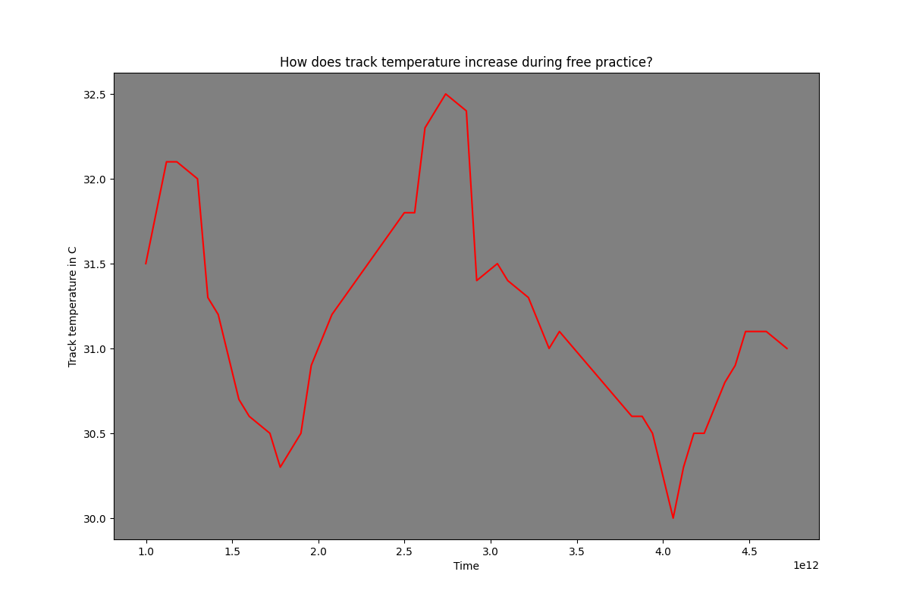
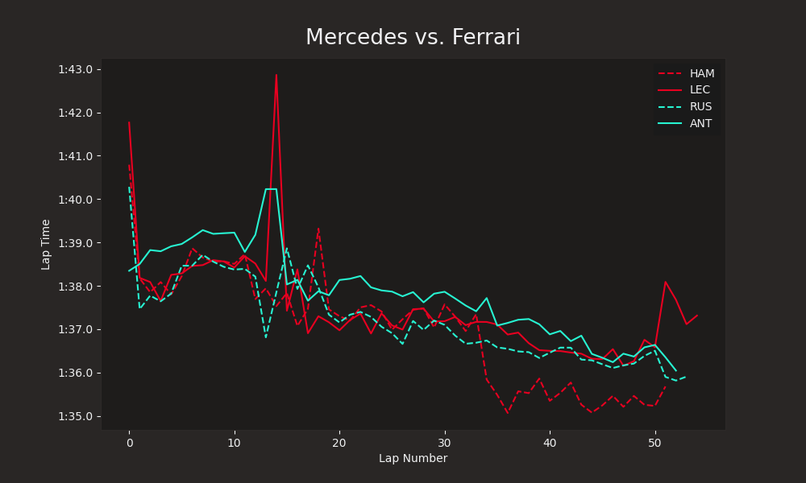

# F1-Tyre-Strategies

In this project, I will be predicting laptimes around the Monaco Circuit by driver Yuki Tsunoda of Racing Bulls

Data collection and cleaning: 
telemetry_data.ipynb
track_conditions.ipynb

Data Analysis was mainly done in 'predicting_laptimes.ipynb' 

I picked XGBoost for optimal performance to minimise the MAE as laptimes in F1 are always very close to each other 

My final model has these metrics:
```
mean_absolute_error: 0.3553657531738281 seconds.
root mean squared error: 0.49268582463264465 seconds.
r2 score : 0.9476191997528076
```

### Collection and Cleaning 

I first got the laptimes of Tsunoda specifically, and the compound used, stint, tyre life 
Then I got the track_conditions after each lap (track_temp, humidity, wind) 

Then I merged all of the data together based on the 'LapNumber' 




